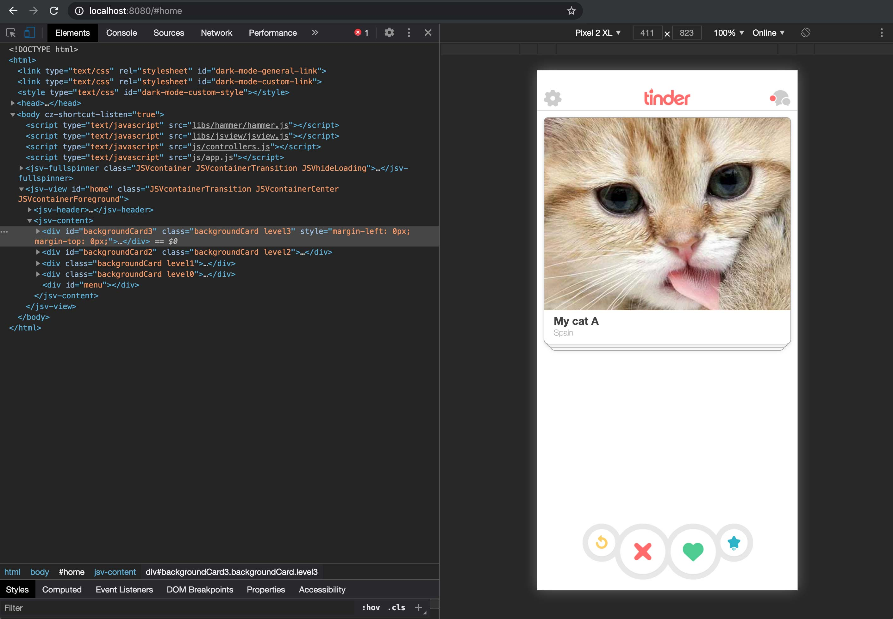

<p align="center">
  
</p>

<h1 align="center">Tinder Interface for Cats</h1>

<p align="center">📱Creating the interface similar to ❤️ Tinder Application with HTML5, CSS3 and JS for cats.</p>

<p align="center">
  <a title="MIT License" href="LICENSE.md">
    
  </a>
  <a title="Twitter: JoseJ_PR" href="https://twitter.com/JoseJ_PR">
    
  </a>  
  <a title="Github: Sponsors" href="https://github.com/sponsors/JoseJPR">
    
  </a>
  <br />
  <br />
</p>

## 🔖 Description

* Tinder Application for cats with HTML5, CSS3 and JS!

Tinder is an application to meet people nearby. It is developed with native language to iOS and Android, and why not with web language and for cats?

### What libraries have been used

* [JavaScript View](https://github.com/CeroyUno/JavaScriptView)
* [HammerJS](http://hammerjs.github.io/)

## 📐 How to work with this project

### 1️⃣ Install this module into your project.

```bash
$npm i
```

### 2️⃣ Run

Run this command in your terminal.

```bash
$npm run start
```

Open your browser: http://localhost:8080

## ⛽️ Review and Update Sependencies

For review and update all npm dependencies of this project you need install in global npm package "npm-check-updates" npm module.

```bash
# Install and Run
$npm i -g npm-check-updates
$ncu
```

## License

[MIT](LICENSE.md)

## Happy Code

Created with JavaScript, lot of ❤️ and a few ☕️

## This README.md file has been written keeping in mind

[GitHub Markdown](https://guides.github.com/features/mastering-markdown/) \
[Emoji Cheat Sheet](https://www.webfx.com/tools/emoji-cheat-sheet/)